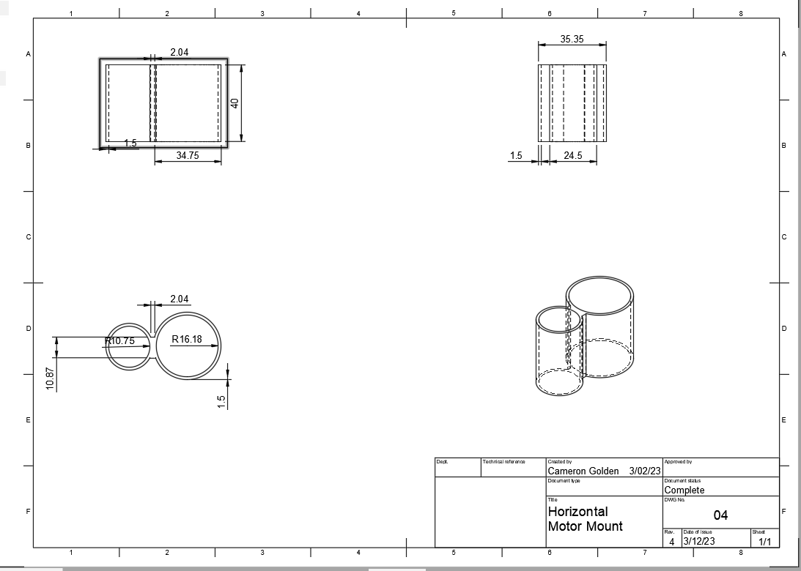
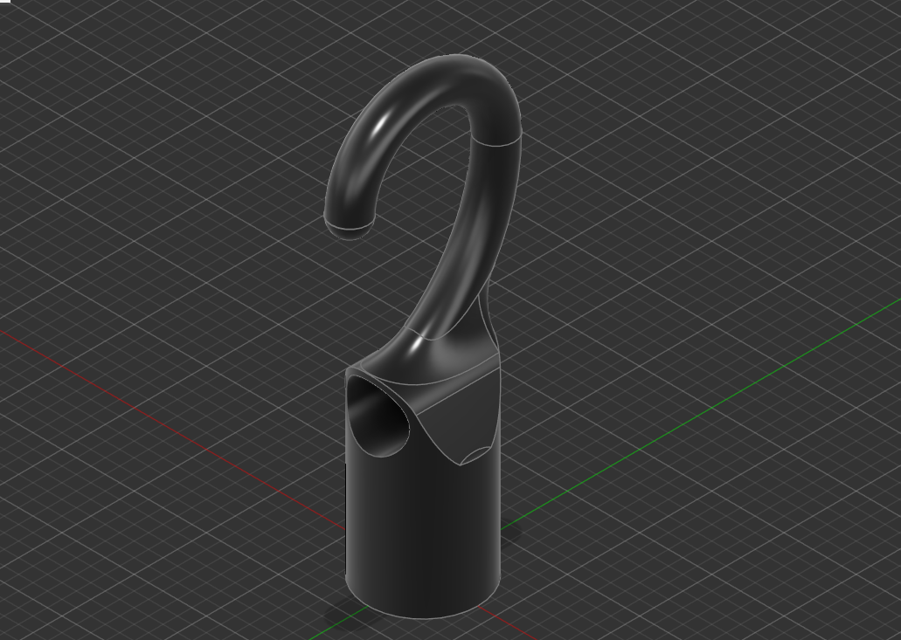

SeaPerch is an international underwater robotics competition, hosted by RoboNation and supported by the US Office of Naval Research, Autodesk, and more. The goal of the program is to create a remotely operated vehicle(ROV) that can complete a series of tasks, which vary by year. The ROV will be operated from outside the water and thetered to the robot by a single cable which is responsible for all power and communication. Teams compete yearly on the Local, Regional and International levels, to continuously improve and innovate on their designs. 

For this project, I was team co-captain and responsible for all 3D design and manufacturing tasks.  I started by creating a 3D Mockup of our prototype ROV frame and creating the first iteration of accessories and mounts. From there, I started protoyping using different simulation programs and a variety of FDM printing materials and styles for funtional version. Eventually, I found the most efficent structure types and shapes to improve hydrodynamics and strength to weight/size ratios. From there, I finished the final models, went through necessecary post processing and finally installed them onto the ROV.

Here are some images that show some of the models and drawings I created:

*Model drawing using Fusion 360*

*A different motor monut, also in fusion 360*

You can learn more at the [SeaPerch Website](https://seaperch.org).
